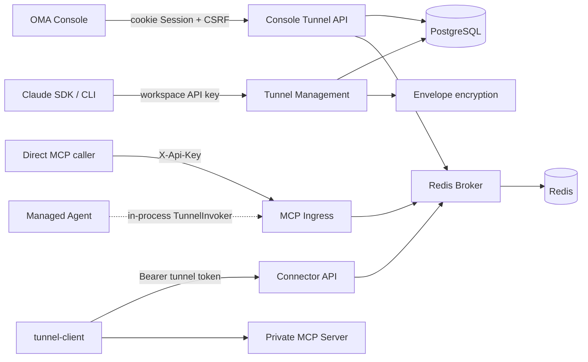
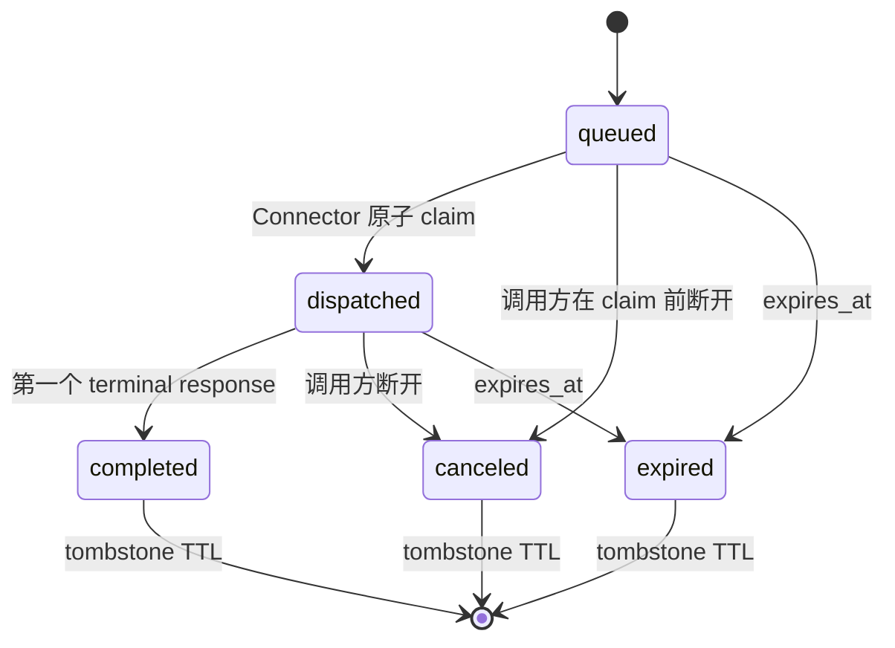

# MCP Tunnel 后端设计

## 目标与兼容边界

MCP Tunnel 允许运行在云端 sandbox 中的 Managed Agent 或直接 MCP 调用方访问只能由私有网络触达的
MCP Server。私网内运行 `tunnel-client`，仅向 OMA 发起出站 HTTPS 长轮询；OMA 不要求私网开放入站
端口。

管理面兼容 Claude Tunnels API：

- 路由使用 `/v1/tunnels`；
- 公开 beta 版本为 `mcp-tunnels-2026-06-22`；
- 服务端额外接受 `mcp-tunnels-2026-05-19` 作为无文档兼容别名；
- 请求、响应、分页和错误信封保持 Claude SDK 可识别；
- OMA 使用现有 workspace API key，不实现 Anthropic WIF issuer；
- certificate 路由保留，但 certificate 暂不参与 Connector 或 MCP 数据面鉴权。

Tunnel 的实际稳定入口是 `/v1/mcp/{tunnel_id}`。Claude 响应中的 `domain` 使用创建时生成且永不复用的
hostname alias：后缀来自可选配置 `tunnel.domain_suffix`，默认是 RFC 保留且不可解析的
`tunnel.invalid`。需要 hostname 入口的生产部署可配置真实后缀，并在服务外配置匹配的 wildcard
DNS/TLS；未配置时 SDK 仍可读取 `domain`，但调用使用 canonical path。

Connector wire 兼容 OpenAI `tunnel-client` 的 poll/response 合同。OMA fork 只调整身份、路径和配置，
保留其 MCP、OAuth、stdio、HTTP 和调度实现。

## 组件与依赖

`internal/api` 只挂载路由和注入依赖。`internal/tunnels` 持有 Claude 兼容管理面、Console 管理面、Connector API、MCP Ingress、
协议类型、错误合同与 Broker。`internal/db` 继续作为唯一 SQL 边界。Code Session 在消费方 package
定义 `TunnelInvoker` 接口，生产组装传入 Tunnel DataPlane，避免进程内 HTTP 回环。

进程只创建一个 Redis client，由 `main` 持有并关闭；Platform Session 与 Tunnel Broker 共享连接池，
但使用互不重叠的 key namespace。

## 路由与鉴权

| 边界 | 路由 | 凭据 | 授权范围 |
| --- | --- | --- | --- |
| 管理面 | `/v1/tunnels...` | `X-Api-Key` 或 Bearer workspace API key | Principal 的 organization + workspace |
| Console 管理面 | `/api/console/organizations/{orgUuid}/workspaces/{workspaceId}/mcp_tunnels...` | 平台 cookie Session；写请求携带现有 `X-CSRF-Token` | 可见 organization + 归属该 organization 的 workspace |
| MCP Ingress | `/v1/mcp/{tunnel_id}[/{channel}]` | 只读取 `X-Api-Key` | Principal 的 organization + workspace |
| Connector metadata | `GET /connector/v1/tunnels/{tunnel_id}` | Bearer tunnel token | token 所属 tunnel |
| Connector 数据面 | `/connector/v1/tunnels/{tunnel_id}/poll`、`response` | Bearer tunnel token | token 所属 tunnel |
| Agent 进程内调用 | `TunnelInvoker` | 已验证的 session ingress JWT 与 URL policy | session 的 organization + workspace |

两个管理面都不增加 tunnel-specific RBAC。`/v1` 继续使用 active workspace API key；Console API 复用
`platformAuthMiddleware`、organization 可见性和 Console workspace scope 解析，不引入第二套鉴权授权。
组织不匹配、workspace 不属于当前组织、或 Tunnel 不属于请求 scope 时统一按不可见资源处理。
所有 PostgreSQL 查询和写入都必须同时绑定 `organization_uuid`、`workspace_uuid` 和 Tunnel 标识。
`rotate_token` 接受 Claude SDK/CLI 的可选 `reason` 字段；在项目建立统一的管理面审计事件框架前，
服务端不持久化也不记录该字段，避免形成 Tunnel 独有且难以演进的审计模型。

MCP Ingress 不消费 `Authorization`；它仅用 `X-Api-Key` 完成 OMA 鉴权，并把允许的
`Authorization` 作为下游 MCP 凭据。Tunnel token 永远不被 MCP Ingress 接受。

Console 列表返回基础 Tunnel 字段、canonical `mcp_url` 和连接快照，不返回 token。plaintext token 只由
`reveal_token` 与 `rotate_token` 响应返回，并使用 `Cache-Control: no-store`。Console 错误使用现有扁平
`{error, message}` 风格，不要求 `anthropic-beta` header。

Connector metadata 与 poll 使用同一 Bearer tunnel token 校验：错误 token、retired token、归档 token
或归档 Tunnel 均拒绝。metadata 返回 `{id, name, description}`；`name` 优先使用 `display_name`，为空时
回退 Tunnel ID，当前 `description` 固定为空字符串，不增加持久化字段。

## 持久化模型

`mcp_tunnels` 保存稳定资源：内部 identity、UUID、Claude external ID、organization/workspace UUID、
display name、全局唯一 domain 和 active/archive 时间。

`mcp_tunnel_token_versions` 独立保存 token version：

- `external_id` 是 Claude token ID；
- `token_hash` 用于 Bearer token 验证；
- token plaintext 只在签发或 reveal 期间存在；
- ciphertext、nonce、wrapped DEK 和 key metadata 复用 `internal/secrets` envelope encryption；
- 每个 Tunnel 只能有一个未 retired、未 archived 的 active token；
- token 轮换时立即清除旧版本的 envelope 字段，只保留 hash、version 与状态供已领取请求完成响应；
- retired token 不能 poll，但可凭领取时绑定的 token version 和 shard 完成在途请求。

Tunnel 旧实现从未投入使用，因此 schema 直接重建，不迁移旧 Tunnel、domain 或明文 token。
`mcp_tunnel_certificates` 的 schema、代码和存量数据保持不变；旧 certificate 可能成为不可达的历史行，
不会自动绑定到新 Tunnel。

项目不创建 PostgreSQL 外键，跨表引用统一使用 UUID。

## Broker 状态机

请求仅在存在 live Connector 时入队。领取操作把 instance ID、shard token 和 token version 原子绑定
到请求。一旦请求进入 `dispatched`，Broker 不做自动重投；Connector 崩溃时请求等待统一 deadline
并过期。notification 不终结请求，第一个 terminal response 完成请求。重复 terminal response 在
tombstone 期内幂等返回成功；response 必须匹配领取时绑定的 instance、shard、token version、channel
和 command type；未知、过期、已取消或绑定不匹配返回 404。

Ingress 在请求入队前先建立 response Pub/Sub 订阅，避免极快 Connector 的首条 notification 落在
“已入队、尚未订阅”的窗口；terminal response 仍写入 request state，因此不依赖 Pub/Sub 可靠性。
Broker 另存 active token version：claim Lua 必须同时匹配该版本。rotate/archive 先暂停该版本、清除
Connector presence 并唤醒长轮询，数据库事务成功后只为新 token 激活版本；原版本仍可按已绑定的
instance、shard 和 token version 提交已 dispatched 请求。

Redis 使用 Sorted Set 保存 channel queue、request state 保存持久终态、Lua 完成原子转换、Pub/Sub
负责唤醒 poll 和转发非终态 notification。进程亲和 owner 同时写入 Hash 与过期 Sorted Set，Broker
在请求清理和 claim 时批量移除过期 owner，避免未显式 DELETE 的历史 MCP session 造成无界增长。
key 使用 `{tunnel_uuid}` hash tag，保证同一 Tunnel 的多键脚本兼容 Redis Cluster。

## 实时连接快照

Console 列表从 Redis presence 构造只读快照。读取时先删除每个 channel 已过期的 presence，再按
instance ID 去重：至少一个 live instance 时为 `connected`，没有 live instance 时为 `disconnected`。
快照返回 channel 名称、`process_affinity`、每个 channel 的 instance 数量和 Tunnel 级去重 instance
总数，不返回 instance ID。

Redis 不可用时，Console API 仍返回 Tunnel 资源，仅将连接状态降级为 `unknown` 并记录安全的结构化
告警；连接状态读取不得阻塞创建、reveal、rotate 或 archive。

## Channel、长轮询与超时

- channel 匹配 `[a-z0-9_-]{1,64}`，每个 Tunnel 最多 32 个；
- Connector 在 poll 中声明 channel allowlist；默认 channel 取 server-info，缺失时为 `main`；
- `proc_affinity` 使用短期 owner lease，只影响后续领取，不允许重放已 dispatched 请求；
- poll limit 默认及最大值为 25，timeout 默认及最大值为 30 秒，空结果返回 204；
- MCP 默认总 deadline 为 2 分钟，可配置范围为 1 秒到 10 分钟；
- `response_timeout` 是统一 deadline 的剩余时间，不启动新的计时窗口；
- 调用方在 dispatch 前断开时删除请求，dispatch 后断开时把请求标记 canceled。

MCP Ingress 不提供独立的 GET SSE 连接，`GET /v1/mcp/{tunnel_id}[/{channel}]` 明确返回 405。
POST 请求仍可在同一个响应内以 SSE 传递 Connector 的非终态 notification，DELETE 继续用于终止 MCP session；
这不会扩展 OpenAI Connector 的 poll/response wire。

## Header 与资源边界

请求 denylist 包含 hop-by-hop、Cookie、`X-Api-Key`、proxy credential、Tunnel token 以及 OMA 内部
header；保留下游 `Authorization`、MCP header 和允许的自定义 header。响应只允许显式协议 header。

默认限制：

- request 或 terminal response body：1 MiB；
- header 总量：32 KiB，单值 8 KiB；
- 每 Tunnel pending request：256；
- 每 Tunnel pending payload：32 MiB；
- completed tombstone：5 分钟；
- presence/affinity lease：60 秒。

超限 body/header 返回 413，队列预算超限返回 429，无 Connector 或 Redis 不可用返回 503，统一
deadline 到期返回 504。Redis 故障时不回退到进程内队列。

运行日志禁止记录 API key、tunnel token、下游 Authorization、Cookie、shard token 和原始 body。

创建、轮换和归档成功事件复用 `slog`、HTTP request ID 和现有 access log，记录 organization、workspace、
Tunnel 与 actor 的安全标识。rotate 的 `reason` 不持久化也不记录。本阶段不新增 Tunnel 专属 metrics、
审计表或事件模型；这些结构化日志用于运维追踪，不宣称为合规审计。

## 验收

实现至少覆盖：Claude SDK 管理面契约、Console Session 与 organization/workspace 越权、Connector metadata、
token rotate 与在途 drain、Redis 并发 claim、presence 快照与故障降级、重复/错误 shard response、取消与
过期、header 清理、Connector notification/terminal wire、无 Connector 快速失败，以及 Web 创建、reveal、
轮换、归档与可见性轮询。

OMA 与 `tunnel-client` 的跨仓核心链路 E2E 在本阶段明确延后；功能稳定后再单独建设与执行。
