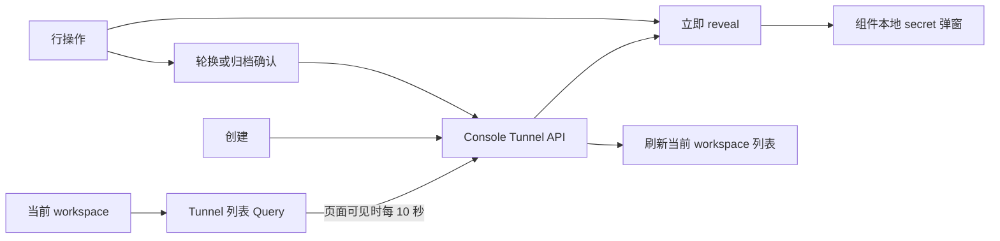

# MCP Tunnel Console 前端设计

## 目标与边界

Tunnel 页面位于 Managed Agents 导航组，路由为 `/workspaces/{workspaceId}/mcp-tunnels`，旧的
`/mcp-tunnels` 入口仍使用当前 workspace。页面只负责 Tunnel 管理闭环，不在本阶段修改 Agent
创建/编辑选择器，也不提供浏览器或服务端 MCP 测试探针。

前端只调用 `/api/console/.../mcp_tunnels`，使用现有 cookie Session。所有创建、reveal、rotate 和 archive
请求携带 bootstrap 提供的 `X-CSRF-Token`，不调用需要 `anthropic-beta` 的 `/v1/tunnels` 管理面。

## 状态与数据流

列表 Query 只保存非敏感 Tunnel DTO 和连接快照。连接状态为 `connected`、`disconnected` 或 `unknown`；
页面可见时每 10 秒刷新，后台标签页停止轮询。状态筛选默认为“活跃”，切换为“全部”时从服务端加载并显示归档资源。

token 不进入 URL、local/session storage 或 TanStack Query 数据。创建完成后先请求 reveal，再把 plaintext
放入弹窗组件状态；查看和轮换使用同一状态边界。弹窗关闭时同时清理 token 和用户输入的本地 MCP URL。

## 交互

- 页面外壳与 Claude Managed Agents 资源页保持一致，共用标题层级、搜索框、状态筛选、无边框数据表、
  行悬浮操作和列表空状态组件；不额外套 Card，也不提供与后台轮询重复的手动刷新按钮；
- 所有 Tunnel 管理文案接入 Console 的中英文国际化目录，语言跟随现有全局设置；
- 搜索支持名称包含匹配或完整 Tunnel ID 精确匹配，筛选无结果时可一键重置；
- 列表显示名称、Tunnel ID、canonical MCP URL、状态、channel/instance 数量和创建时间；
- 创建后展示 token、canonical MCP URL 和可复制的 tunnel-client YAML；
- YAML 固定 `url_path: /connector`，使用 `env:OMA_TUNNEL_TOKEN`，本地 MCP URL 由用户填写；
- 行操作支持复制 URL、查看 token、轮换 token 和归档；
- 轮换与归档必须使用 Alert Dialog 确认；归档资源的 secret mutation 禁用；
- loading、empty、request error 和 mutation error 都有独立状态。

## 验收

前端单测覆盖 Console 路径、cookie credentials、CSRF header、创建后 reveal、YAML、secret 不进入 Query、
轮换、归档、搜索、归档状态筛选、中英文文案、空/错状态及可见性轮询策略。构建后还需要重启本地
server/web，并在浏览器验证完整管理流程及其与 Managed Agents 页面的一致性。
